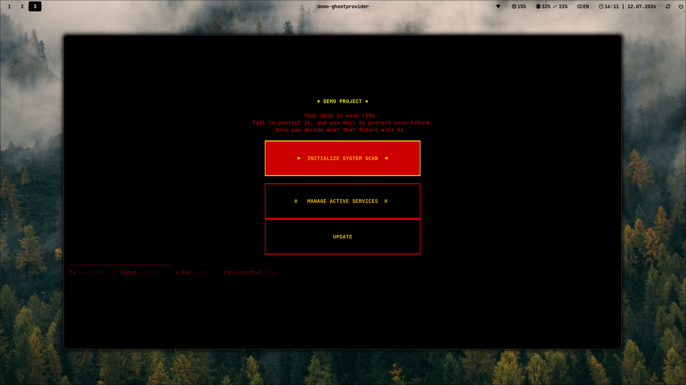

> TUI for self-hosting & localhost management.
> Your data stays yours — local, private, under your control.

## One-Click Deploy

Paste a GitHub URL — get a host score — deploy as a systemd service.
Private, local, no third parties.



## Requirements

- Python 3.10+
- systemd (user-level)
- git
- Linux (tested on Arch, Ubuntu, Fedora)

## Tech Stack

- Python 3.10+ / [Textual](https://github.com/Textualize/textual) (TUI framework)
- systemd (user-level service management)
- requests (GitHub API interaction)

## Why systemd?

GhostProvider uses systemd user-level services because they provide:
- **No root required** — every user can manage their own services
- **Auto-start on login** — services survive reboots without manual config
- **Clean removal** — `systemctl --user disable` + delete unit file = zero leftovers
- **Sandboxing** — built-in security directives (NoNewPrivileges, ProtectHome, ProtectSystem)

This is the standard on Arch, Ubuntu, Fedora, Debian, and most modern Linux distributions.

## Security Model

- **All data stays local** — no telemetry, no external requests beyond GitHub API
- **No root required** — services run as systemd user-level units
- **Sudo requested only for:** package installation (apt/pacman)
- **Password handled securely** — verified locally via `sudo -S`, never stored on disk
- **Service sandboxing:**
  - `NoNewPrivileges=yes` — prevents privilege escalation
  - `ProtectHome=read-only` — no write access to home directory
  - `ProtectSystem=read-only` — read-only filesystem except working directory
  - `ReadWritePaths` — restricted to deployed project directory only

## System Scan

Scans your machine for prerequisites, detects all listening ports, fingerprints known services (VERT, SearXNG, Memos...) and maps your network — gateway, DNS.

## Control panel

Full dashboard for all deployed services. Start, stop, restart, or remove — one click cleans the service, unit file, cloned repo, and lingering ports. Zero leftovers.

## Service support

This is a restricted demo version of GhostProvider that only supports deploying the following services:

- **VERT** - https://github.com/VERT-sh/VERT
- **SearXNG** - https://github.com/searxng/searxng
- **Memos** - https://github.com/usememos/memos

## Quick Start (Linux)

```bash
curl -sSL https://raw.githubusercontent.com/iamnetuseragent/demo-ghostprovider/main/install.sh | bash
```

## Uninstall

```bash
curl -sSL https://raw.githubusercontent.com/iamnetuseragent/demo-ghostprovider/main/uninstall.sh | bash
```

## Install (Arch Linux)

```bash
git clone https://github.com/iamnetuseragent/demo-ghostprovider.git
cd demo-ghostprovider
makepkg -si
```

## Usage

```bash
demo-ghostprovider
```
